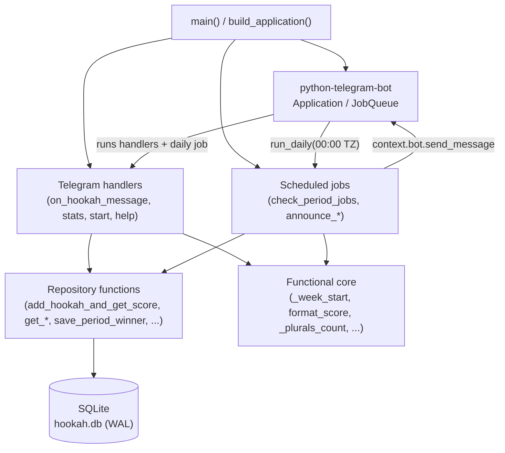

# Architecture

> Read [`agent-rules.md`](agent-rules.md) first for layer constraints. This file
> describes the overall shape; cross-links: [`api.md`](api.md),
> [`domain.md`](domain.md), [`database.md`](database.md),
> [`workers.md`](workers.md), [`integrations.md`](integrations.md),
> [`request-flows.md`](request-flows.md).

## 1. Project Overview

**nargila-counter** is a Telegram bot that runs an **anti-rating of hookah
smoking** in group chats: the fewer hookahs you smoke, the higher you rank
(🥇 goes to the lightest smoker).

- **Business purpose**: friendly social pressure to smoke less, with weekly and
  monthly "winners" (least-smoked) announced automatically.
- **Main use cases**:
  1. A user posts a photo with the caption `+1` → the bot records a hookah for
     that user and replies with the **current week's** leaderboard.
  2. `/stats` → replies with the **all-time** leaderboard plus each user's
     win counts (weeks/months won).
  3. `/stats week|month` → leaderboard scoped to the current week/month.
  4. On Monday 00:00 and the 1st of each month 00:00 (local TZ), the bot
     announces the **previous** period's winner in every chat it knows about.
- **Target users**: members of small private Telegram group chats (the bot is
  added to a group; BotFather privacy mode must be **disabled** so it receives
  non-command messages).
- **Core workflows**: message ingestion (photo + `+1`), period scoring,
  scheduled winner announcement, period-winner bookkeeping.
- **Major subsystems** (all inside the single module `main.py`, see
  [`domain.md`](domain.md) for the responsibility map):
  - Telegram handlers (commands + photo message)
  - Persistence layer (SQLite, WAL, autocommit + explicit transactions)
  - Period arithmetic & scoring
  - Scheduled jobs (APScheduler via `python-telegram-bot` job queue)
  - Logging (rotating file + console)

## 2. Architecture

This is intentionally a **single-file modular script**, not a layered
enterprise app. There is no framework DI, no repository classes, no separate
service classes. Patterns present:

- **Module-level responsibility slots** (`main.py` is divided by `# ----` section
  banners into Logging → DB → Formatting → Message helpers → Handlers →
  Scheduled jobs → Entrypoint). Each slot is a set of module-level functions,
  not a class. Treat each banner as a virtual "layer".
- **Functional core**: pure functions (`_week_start`, `_month_start`,
  `_plurals_count`, `_place_icon`, `format_score`, `has_image`, `PLUS_ONE_RE`)
  contain no I/O and are fully unit-tested.
- **Procedural repository functions**: `_connect`, `init_db`,
  `add_hookah_and_get_score`, `get_score`, `get_period_score`,
  `get_win_counts`, `get_all_chat_ids`, `save_period_winner`,
  `determine_period_winner`. These own all SQL and are the only functions
  allowed to touch the DB (see [Rules](agent-rules.md)).
- **Thin async Telegram handlers** wrap the functional core + repository
  functions (`on_hookah_message`, `stats`, `start`, `help_command`).
- **Scheduler adapters**: `check_period_jobs` → `announce_weekly_winner` /
  `announce_monthly_winner` → `_announce_period_winner` (shared template-method
  style for both periods).
- **Adapter to Telegram SDK**: `build_application` wires handlers into a
  `python-telegram-bot` `Application` and registers the daily job.

**Assumption**: there is no formal "DDD/Hexagonal/CQRS" layering. When a rule
below says "repository layer", it means *the set of repository functions
listed in* [`database.md`](database.md) §Repository Layer, *not a package*.

## 3. Source Tree Map

```
nargila-counter/
├── main.py               # THE application: all handlers, DB, scoring, scheduler
├── tests/
│   └── test_main.py      # pytest suite (functional core, DB, handlers, scheduler)
├── Dockerfile            # python:3.12-slim, installs python-telegram-bot==22.7
├── deploy.sh             # Mac-local SSH driver that deploys to CasaOS (see README)
├── pyproject.toml        # deps + ruff/pytest config
├── uv.lock               # lockfile (uv-managed)
├── .env.example          # documents TELEGRAM_BOT_TOKEN
├── .python-version       # 3.12
├── README.md             # user + deploy docs (Russian)
└── hookah.db             # LOCAL dev DB (gitignored, do not ship)
```

| Path | Purpose | Owns | Must NOT contain |
|------|---------|------|------------------|
| `main.py` | All bot logic | Handlers, DB access, scoring, scheduling, logging | Test code; secrets |
| `tests/test_main.py` | Behaviour + unit tests | Assertions, fixtures, `SimpleNamespace` doubles | Real Telegram API calls; real network |
| `Dockerfile` | Image definition | Base image, env defaults, `VOLUME /data` | Secrets (token comes via `.env` at runtime) |
| `deploy.sh` | Deploy driver (runs on Mac) | SSH orchestration, volume/env wiring | Secrets — reads `~/nargila-counter/.env` **on the server only** |
| `.env.example` | Secret documentation | Lists required env vars | Real tokens |

There is no `src/`, no package — `main.py` is imported directly (tests do
`import main`). Do not introduce a package boundary without reason.

## 12. Dependency Graph



**Dependency direction**: `Entrypoint → Handlers/Scheduler → {Core, Repo}`,
and `Repo → DB`. The functional core depends on nothing. Repository functions
depend only on `sqlite3` and the core helpers. Handlers depend on the core +
repo + the Telegram SDK surface (via `Update`, `reply_text`, `context.bot`).

**Forbidden (enforced by convention, see agent-rules)**:
- Handlers must not write raw SQL.
- Functional core must not import `sqlite3` or `telegram`.
- The scheduler must not mutate `hookah_stats`; it only reads logs and writes
  `period_winners`.

## 15. Code Ownership and Responsibilities

| Owner | Owns | May call | May NOT call |
|-------|------|----------|--------------|
| **Functional core** (`_week_start`, `format_score`, `_plurals_count`, `has_image`, `PLUS_ONE_RE`, …) | Pure scoring/formatting logic | stdlib only | `sqlite3`, `telegram`, any I/O |
| **Repository functions** (`add_hookah_and_get_score`, `get_*`, `save_period_winner`, `determine_period_winner`, `init_db`, `_connect`) | All SQL, schema, transactions | `sqlite3`, core helpers | `telegram`; formatting; business decisions beyond "fewest wins" |
| **Handlers** (`on_hookah_message`, `stats`, `start`, `help_command`) | Translating Telegram updates → repo calls → reply text | core, repo, `update.effective_message.reply_text` | Raw SQL; timezone math (use core) |
| **Scheduler** (`check_period_jobs`, `announce_weekly_winner`, `announce_monthly_winner`, `_announce_period_winner`) | Period winner detection + announcement + bookkeeping | core (`_prev_*_range`), repo (`get_all_chat_ids`, `determine_period_winner`, `save_period_winner`), `context.bot.send_message` | Writing to `hookah_stats`; replying to individual messages |
| **Entrypoint** (`main`, `build_application`, `setup_logging`) | Wiring, lifecycle | Everything above | Touching rows directly |

## 17. Technical Debt

- **Single 640-line file.** All subsystems live in `main.py`. Acceptable at this
  size, but the natural split when it grows is `db.py` (repo + `_connect` +
  `init_db`), `periods.py` (core period/scoring helpers), `formatting.py`, and
  `handlers.py`. Do not split preemptively.
- **Timezone assumption in `created_at`.** `hookah_log.created_at` uses SQLite
  `CURRENT_TIMESTAMP`, which is **UTC**. Period comparisons use `_week_start()`
  / `_month_start()` as **local** date strings. Around local midnight this can
  mis-boundary a row by up to a few hours. Not yet a reported bug; flagged as an
  assumption. Fix would be storing TZ-aware timestamps or computing period
  boundaries in UTC consistently.
- **`get_all_chat_ids()` derives chats from `hookah_stats`, not `hookah_log`.**
  A chat where every user somehow has 0 lifetime count would be skipped by the
  scheduler. Practically irrelevant (the table starts at count=1 on first +1),
  but the "source of truth for known chats" should arguably be `hookah_log`.
- **No `/reset` or admin command.** There is no in-bot way to fix bad data;
  corrections require direct DB edits (see `deploy.sh ssh`).
- **`deploy.sh` hardcodes `REMOTE_DIR="/home/casaos/nargila-counter"`** and
  `DATA_VOLUME="nargila-counter-data"`. Renaming the container is safe; renaming
  either of these will silently drop state (see commit `8a35291` which fixed
  exactly this regression).
- **No CI.** Tests run locally via `pytest`; there is no GitHub Actions workflow
  gating PRs.
