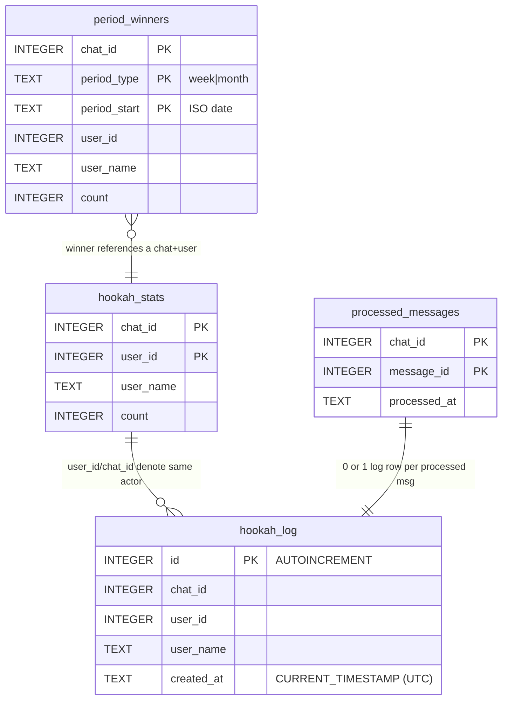

# Database

> SQLite (single file at `$DB_PATH`, default `/data/hookah.db` in the container,
> backed by Docker volume `nargila-counter-data`). Connection is configured for
> **WAL** journal mode, `synchronous=NORMAL`, `busy_timeout=30000ms`, autocommit
> (`isolation_level=None`); explicit `BEGIN/COMMIT/ROLLBACK` is used where
> atomicity matters. See [`architecture.md`](architecture.md) for which layer
> may touch these tables.

## Schema

All tables are created idempotently by `init_db()` with `CREATE TABLE IF NOT
EXISTS`, so `init_db()` is safe to call on every startup against an existing DB
— it never overwrites rows.



### `hookah_stats` — lifetime count per user per chat
| Field | Type | Notes |
|---|---|---|
| `chat_id` | INTEGER | Part of PK; Telegram chat id (negative for groups) |
| `user_id` | INTEGER | Part of PK; Telegram user id (stable across username changes) |
| `user_name` | TEXT | Display name, refreshed on each +1 |
| `count` | INTEGER | Default 0, but in practice first insert sets it to 1 |

PK: `(chat_id, user_id)`. No foreign keys (SQLite, no FK enforcement by default).

### `hookah_log` — append-only event log
| Field | Type | Notes |
|---|---|---|
| `id` | INTEGER | `PRIMARY KEY AUTOINCREMENT` |
| `chat_id`, `user_id`, `user_name` | | Denormalized from the stats row at write time |
| `created_at` | TEXT | `DEFAULT CURRENT_TIMESTAMP` (**UTC**) |

Index: `idx_hookah_log_chat_created ON (chat_id, created_at)` — supports the
period-score and winner queries. This is the only secondary index.

### `processed_messages` — dedup token
| Field | Type | Notes |
|---|---|---|
| `chat_id`, `message_id` | INTEGER | PK together = one Telegram message |
| `processed_at` | TEXT | `DEFAULT CURRENT_TIMESTAMP` |

### `period_winners` — award bookkeeping
| Field | Type | Notes |
|---|---|---|
| `chat_id`, `period_type`, `period_start` | | PK together; one winner per period per chat |
| `user_id`, `user_name` | | The winner (least-smoked) |
| `count` | INTEGER | The winner's hookah count during that period |

## Repository Layer

All SQL lives in these functions and **nowhere else**. Handlers must call them,
never write SQL.

| Function | Writes? | Purpose | Transactional? |
|---|---|---|---|
| `_connect()` | — | Opens a WAL/autocommit connection with `busy_timeout=30000` | — |
| `init_db()` | DDL | `CREATE TABLE IF NOT EXISTS` for all 4 tables + the log index; safe on existing DB | per-statement autocommit |
| `add_hookah_and_get_score(chat_id, message_id, user) -> (rows, was_new)` | **yes** | Dedup → insert stats → append log → read score, **all in one `BEGIN/COMMIT`**; `ROLLBACK` on any exception | **yes, explicit** |
| `get_score(chat_id) -> [(name, count)]` | no | Lifetime leaderboard (anti-rating order) | read |
| `get_score_with_user_ids(chat_id) -> [(uid, name, count)]` | no | Same, with `user_id` (for joining win counts) | read |
| `get_period_score(chat_id, period_type) -> [(name, count)]` | no | Counts `hookah_log` rows since the current period's start (Mon / 1st) | read |
| `get_win_counts(chat_id) -> {uid: {period_type: wins}}` | no | Aggregates `period_winners` | read |
| `get_all_chat_ids() -> [int]` | no | Distinct `chat_id`s from `hookah_stats` (used by the scheduler) | read |
| `save_period_winner(chat, type, start, uid, name, count)` | **yes** | `INSERT OR IGNORE` into `period_winners` (idempotent) | autocommit |
| `determine_period_winner(chat, start, end) -> (name, uid, count) \| None` | no | `hookah_log` grouped by user, ordered `cnt ASC`, `LIMIT 1` | read |

### Transactional boundary (important)

`add_hookah_and_get_score` is the **only** multi-statement transaction:

```python
conn.execute("BEGIN")
try:
    dedup = INSERT OR IGNORE INTO processed_messages ...
    if dedup.rowcount == 0:   # duplicate
        COMMIT; return score, False
    INSERT INTO hookah_stats ... ON CONFLICT DO UPDATE count = count + 1
    INSERT INTO hookah_log ...
    score = read
    COMMIT
except Exception:
    ROLLBACK; raise
```

This guarantees a Telegram message is counted **exactly once** even under
concurrent updates (WAL + `busy_timeout` serializes writers).

### Migrations

There is **no migration framework**. Schema changes require:
1. Editing `init_db()` (keep `IF NOT EXISTS` so existing DBs upgrade cleanly on
   next startup).
2. For destructive changes (rename/drop column), ship a one-off SQL script run
   via `deploy.sh ssh` against the volume's `hookah.db`.

Backups of the live DB are kept next to it as `hookah.db.bak.<timestamp>` on the
server volume — see `deploy.sh` and the recovery notes in README.
