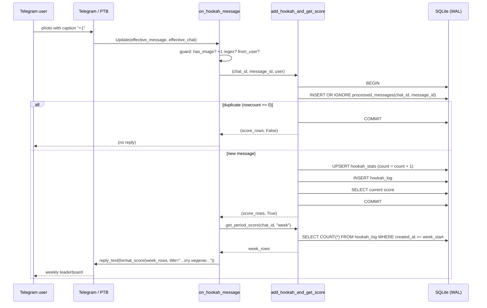
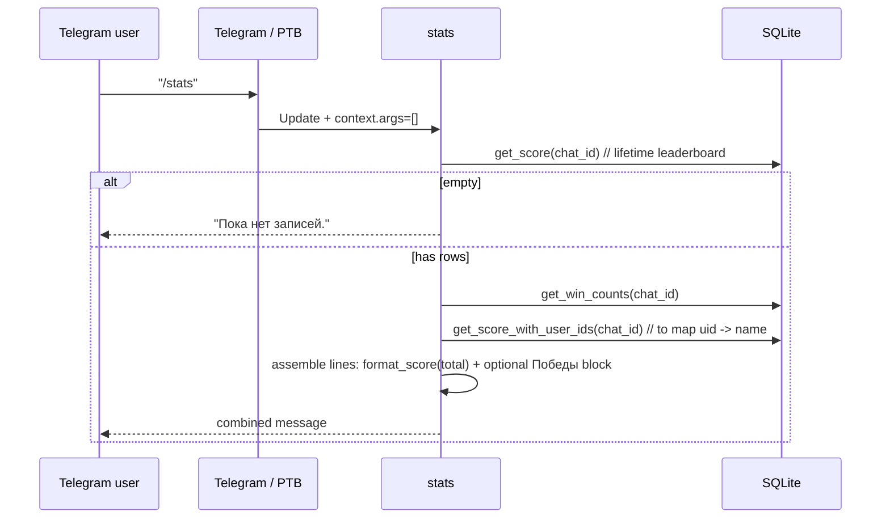
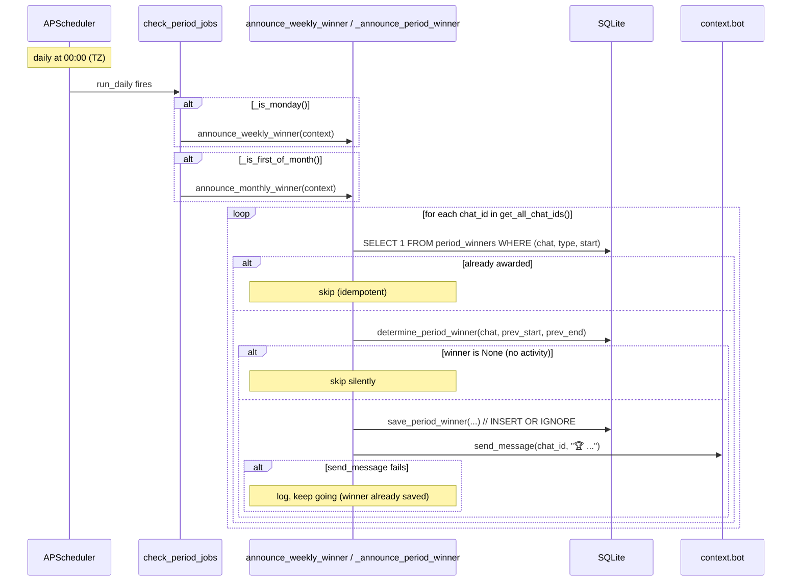

# Request Flows

> Step-by-step scenarios. Cross-link: [`api.md`](api.md) for trigger contracts,
> [`database.md`](database.md) for the SQL, [`workers.md`](workers.md) for the
> scheduler.

## A. Photo `+1` ingestion (the main flow)

Key points:
- The dedup gate is **inside** the same transaction as the count increment —
  a crash mid-way cannot double-count.
- The **reply shows the current week**, not the all-time total (the all-time
  view is reserved for `/stats`). See commit `0e8098c`.
- If the photo has no `+1`, or no photo, or no `from_user`, the handler returns
  silently — no error, no reply.

## B. `/stats` (all-time + win counts)

The `🏆 Победы` block is appended **only** when `get_win_counts` returns
non-empty. Each winner line shows both week and month counts
(`@name: недель — N, месяцев — M`); users with zero wins of both types are
omitted.

## C. `/stats week` / `/stats month`

1. `stats` lowercases and strips `context.args[0]`.
2. Matches against the alias set (`w/week/неделя/неделю/нед` or
   `m/month/месяц/мес`).
3. `get_period_score(chat_id, period_type)` → `SELECT user_name, COUNT(*) FROM
   hookah_log WHERE chat_id=? AND created_at >= <period_start> GROUP BY user_id
   ORDER BY cnt ASC, user_name ASC`.
4. If empty → `За этот период записей пока нет.`
5. Else render rows with `_place_icon` under the period-specific title.

## D. Scheduled weekly/monthly winner announcement

Important: `save_period_winner` runs **before** `send_message`. If the message
fails (bot kicked, chat deleted), the winner is still recorded — so we never
re-announce the same period on the next run.

## E. Container startup

1. `main()` → `setup_logging()` (console + rotating file).
2. `init_db()` — `CREATE TABLE IF NOT EXISTS` for all 4 tables + the log index.
   Safe on existing DB; no data loss on redeploy.
3. `build_application()`:
   - reads `TELEGRAM_BOT_TOKEN` (raises if missing);
   - registers `start`, `help`, `stats`, photo message handler, error handler;
   - registers `run_daily(check_period_jobs, 00:00 TZ)` if `job_queue` exists
     (logs a warning if not — e.g. missing `[job-queue]` extra).
4. `app.run_polling(allowed_updates=Update.ALL_TYPES, drop_pending_updates=False)`.
5. The container restart policy is `unless-stopped`, so a crash (e.g. transient
   token error) self-heals.
